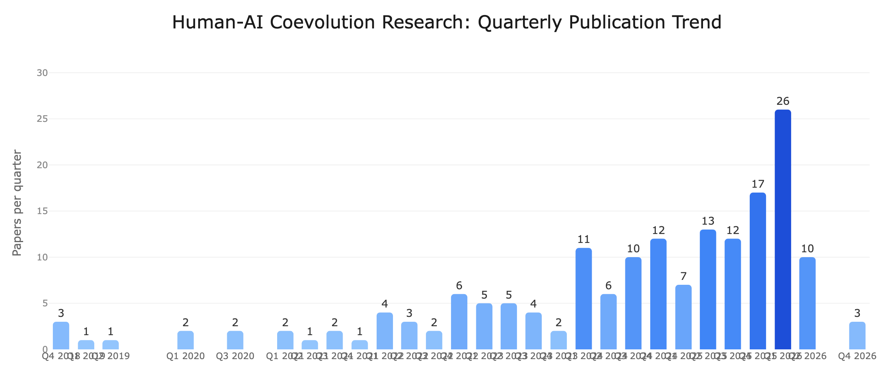

# Awesome Human-AI Coevolution Paper List

A curated index of **110** research papers on **how humans must evolve to use AI well as AI advances**. Organized by the four-phase framework — _Humans Use AI as Tool · Assistant · Executor · Organization_. Each paper is grounded evidence for one phase: what capability humans must sustain at that phase, how it weakens without active effort, and how AI systems can be designed to support that human evolution.

> As humans delegate more to AI, the capabilities humans need shift: from critical thinking, to evaluative expertise, to metacognitive monitoring, to systems thinking. When human evolution lags AI advancement, the failure modes pile up: weakened reasoning, polished-but-flawed artifacts approved, autonomous workflows drifting unmonitored, coordinated agent systems running opaque. This index curates the research that documents that human side.

The structured store [`papers.yaml`](papers.yaml) is the source of truth — the README, statistics, and the website are auto-generated from it. See [`CLAUDE.md`](CLAUDE.md) for the schema and contribution workflow.

## Index by Phase
**Phase 1** (40) · **Emerging Phase 2** (6) · **Phase 2** (32) · **Emerging Phase 3** (4) · **Phase 3** (8) · **Emerging Phase 4** (7) · **Phase 4** (0) · **Surveys & Position Papers** (13)

### Secondary axis — paper themes

`CC` **Collaboration & Co-Creation** (39) · `MA` **Mutual Adaptation** (45) · `HF` **Human Feedback Loops** (26) · `LH` **Longitudinal HCI Studies** (30) · `PS` **Position & Survey** (21)

## Top Keywords
`Copilot` (8) · `ChatGPT` (7) · `productivity` (7) · `RLHF` (7) · `longitudinal` (6) `trust` (5) · `RCT` (5) · `co-writing` (5) · `dataset` (3) · `alignment` (3) `ideation` (3) · `personalization` (3) · `GenAI` (3) · `sycophancy` (3) · `LLM` (3) `perception` (3) · `survey` (2) · `benchmark` (1)

## Top Contributing Authors
Mor Naaman (6) · Zahra Zahedi (5) · Subbarao Kambhampati (5) · Diyi Yang (4) · Daniel Buschek (4) Sarath Sreedharan (4) · Dario Amodei (4) · Amanda Askell (3) · Jeffrey T. Hancock (3) · Jan Leike (3) Vishakh Padmakumar (2) · Advait Bhat (2) · Maurice Jakesch (2) · Jeffrey P. Bigham (2) · Tawfiq Ammari (2) Meilun Chen (2) · S. M. Mehedi Zaman (2) · Kiran Garimella (2) · Agnia Sergeyuk (2) · Viktoria Stray (2)

## Contributing

We welcome contributions from the community!

- **Missing a paper?** Open an issue with the paper title, link, and any relevant details — we'll add it.
- **Want to add papers yourself?** Edit [`papers.yaml`](papers.yaml), run `bash scripts/update_repo.sh`, then submit the regenerated diff. See [`CLAUDE.md`](CLAUDE.md) for the YAML schema.
- **Spotted an error?** Open an issue or PR to correct any paper metadata (authors, dates, institutions, etc.).

## Papers by Phase

> Phases come from the four-phase framework (_Tool · Assistant · Executor · Organization_) — see [`deep_research/phased_framework.md`](deep_research/phased_framework.md) for definitions and the [position paper PDF](deep_research/) for full context. Each paper is assigned a single phase (with `emerging-phase-X` for clear bridge cases). Within a phase, papers are listed newest-first. The secondary 5-category axis (CC/MA/HF/LH/PS) is shown on each entry.

### Phase 1 — Humans Use AI as Tool  (40 papers)

_Humans use AI to answer questions. To use AI well here, humans must sustain **critical thinking** — comparing AI outputs against their own reasoning rather than absorbing them passively. The capability erodes through uncritical acceptance, and the feedback that erosion produces pushes models toward sycophancy._

- [AI Assistance Reduces Persistence and Hurts Independent Performance](https://arxiv.org/abs/2604.04721)
    - Grace Liu, Brian Christian, Tsvetomira Dumbalska, Michiel A. Bakker, Rachit Dubey
    - Institutions: CMU, U. Oxford, MIT, UCLA
    - Date: April 06, 2026
    - Venue: arXiv
    - Category: LH, MA (Longitudinal HCI Studies, Mutual Adaptation)
    - Keywords: persistence, independent performance, RCT, math reasoning, reading
    - TLDR: RCTs with 1,222 participants; AI assistance improves immediate performance but reduces persistence and impairs independent performance after AI removal.

- [Reactive Writers: How Co-Writing with AI Changes How We Engage with Ideas](https://arxiv.org/abs/2603.10374)
    - Advait Bhat, Marianne Aubin Le Quéré, Mor Naaman, Maurice Jakesch
    - Institutions: Cornell Tech
    - Date: March 11, 2026
    - Venue: arXiv
    - Category: MA (Mutual Adaptation)
    - Keywords: reactive writing, suggestion-led writing, ideation, evaluation-first
    - TLDR: N=19 interviews + 1,291 sessions; AI suggestions shift writing from ideation-first to evaluation-first ("reactive writing"), with users unaware of the influence.

- [The Path to Conversational AI Tutors: Integrating Tutoring Best Practices and Targeted Technologies to Produce Scalable AI Agents](https://arxiv.org/abs/2602.19303)
    - Kirk Vanacore, Ryan S. Baker, Avery H. Closser, Jeremy Roschelle
    - Institutions: WPI, U. Penn, Worcester State, Digital Promise
    - Date: February 22, 2026
    - Venue: arXiv
    - Category: CC, LH (Collaboration & Co-Creation, Longitudinal HCI Studies)
    - Keywords: conversational tutors, knowledge tracing, affect detection, GenAI tutoring
    - TLDR: Argues GenAI tutors can simulate high-quality human tutoring; integrates established practices (knowledge tracing, affect detection) with new dynamic content generation.

- [Belief Offloading in Human-AI Interaction](https://arxiv.org/abs/2602.08754)
    - Rose E. Guingrich, Dvija Mehta, Umang Bhatt
    - Institutions: Princeton, Cambridge
    - Date: February 09, 2026
    - Venue: arXiv
    - Category: HF, MA (Human Feedback Loops, Mutual Adaptation)
    - Keywords: belief offloading, cognitive offloading, sycophancy, epistemic agency
    - TLDR: Defines "belief offloading" — users delegate forming/upholding beliefs to AI — drawing from philosophy, psychology, and CS. Provides taxonomy and normative considerations.

- [AI-Augmented Strategic Decision-Making Under Time Constraints: An Experimental Study on Mental Representations and Strategic Foresight](https://pubsonline.informs.org/doi/10.1287/stsc.2025.0442)
    - Tim Kanis, Justus Emanuel Mann, Jutta Stumpf-Wollersheim
    - Institutions: —
    - Date: February 04, 2026
    - Venue: Strategy Science 2026
    - Category: MA, CC (Mutual Adaptation, Collaboration & Co-Creation)
    - Keywords: strategic decision-making, mental representations, LLM, time constraints, foresight
    - TLDR: Experimental study (N=348); LLM use broadens representation breadth but decreases depth and increases information overload, without improving foresight.

- [How RLHF Amplifies Sycophancy](https://arxiv.org/abs/2602.01002)
    - Itai Shapira, Gerdus Benade, Ariel D. Procaccia
    - Institutions: Harvard, Boston University
    - Date: February 01, 2026
    - Venue: arXiv
    - Category: HF (Human Feedback Loops)
    - Keywords: sycophancy, RLHF, covariance condition, preference training
    - TLDR: Formal analysis showing how preference-based post-training amplifies sycophancy via a covariance condition between belief endorsement and learned reward; proposes a closed-form correction.

- [Human-AI perception: not much different, but some distinct novelties](https://www.emerald.com/bl/article/doi/10.1108/BL-08-2025-0181/1337901/Human-AI-perception-not-much-different-but-some)
    - Michael Leyer, Johannes Wichmann, Wieland Müller, Lilian Tai Do Khac, Alexander Richter
    - Institutions: University of Rostock
    - Date: January 29, 2026
    - Venue: The Bottom Line 2026
    - Category: PS, MA (Position & Survey, Mutual Adaptation)
    - Keywords: AI perception, GenAI, viewpoint, methodology, user research
    - TLDR: Argues research on human-AI perception must explicitly specify AI characteristics (probabilistic, conversational, adaptive) rather than treating "AI" as a generic category — to capture distinct novelties of GenAI.

- [How AI Impacts Skill Formation](https://arxiv.org/abs/2601.20245)
    - Judy Hanwen Shen, Alex Tamkin
    - Institutions: Stanford, Anthropic
    - Date: January 28, 2026
    - Venue: arXiv
    - Category: MA, LH (Mutual Adaptation, Longitudinal HCI Studies)
    - Keywords: skill atrophy, AI assistance, developer learning, RCT
    - TLDR: RCT with 52 engineers learning a new Python library; AI-assisted group scores 17% lower on comprehension/debugging without significant productivity gain.

- [Learning to Live with AI: How Students Develop AI Literacy Through Naturalistic ChatGPT Interaction](https://arxiv.org/abs/2601.20749)
    - Tawfiq Ammari, Meilun Chen, S. M. Mehedi Zaman, Kiran Garimella
    - Institutions: Rutgers
    - Date: January 28, 2026
    - Venue: arXiv
    - Category: LH (Longitudinal HCI Studies)
    - Keywords: AI literacy, repair literacy, genres, undergraduate, longitudinal
    - TLDR: Analyzes 10,536 ChatGPT messages from 36 undergraduates over an academic year; identifies 5 use genres and introduces the concept of "repair literacy".

- [AI in the classroom: Exploring students' interaction with ChatGPT in programming learning](https://link.springer.com/article/10.1007/s10639-025-13337-7)
    - Hacer Güner, Erkan Er
    - Institutions: METU
    - Date: 2025
    - Venue: Education and Information Technologies 2025
    - Category: LH (Longitudinal HCI Studies)
    - Keywords: programming learning, prompting, instructional intervention, ChatGPT
    - TLDR: Three-session study with progressive scaffolding; identifies 5 AI interaction profiles in programming learning.

- [Interactions with generative AI chatbots: unveiling dialogic dynamics, students' perceptions, and practical competencies in creative problem-solving](https://doi.org/10.1186/s41239-025-00508-2)
    - Yu Song, Longchao Huang, Lanqin Zheng, Mengya Fan, Zehao Liu
    - Institutions: Beijing Normal University
    - Date: 2025
    - Venue: International Journal of Educational Technology in Higher Education 2025
    - Category: CC, LH (Collaboration & Co-Creation, Longitudinal HCI Studies)
    - Keywords: dialogic dynamics, creative problem-solving, GenAI chatbots, perception
    - TLDR: Interaction-centered study of dialogic dynamics with GenAI chatbots in creative problem-solving.

- [Personalization capabilities of current technology chatbots in a learning environment: An analysis of student-tutor bot interactions](https://link.springer.com/article/10.1007/s10639-025-13369-z)
    - Chee-Kit Looi, Fenglin Jia
    - Institutions: —
    - Date: 2025
    - Venue: Education and Information Technologies 2025
    - Category: MA, LH (Mutual Adaptation, Longitudinal HCI Studies)
    - Keywords: personalization, chatbots, student-tutor interaction, scaffolding
    - TLDR: Examines how current chatbots implement personalization features in actual student-tutor bot interactions.

- [Your Brain on ChatGPT: Accumulation of Cognitive Debt when Using an AI Assistant for Essay Writing Task](https://arxiv.org/abs/2506.08872)
    - Nataliya Kosmyna, Eugene Hauptmann, Ye Tong Yuan, Jessica Situ, Xian-Hao Liao, Ashly Vivian Beresnitzky, Iris Braunstein, Pattie Maes
    - Institutions: MIT Media Lab
    - Date: June 10, 2025
    - Venue: arXiv
    - Category: LH, MA (Longitudinal HCI Studies, Mutual Adaptation)
    - Keywords: EEG, cognitive debt, neural connectivity, ownership, recall
    - TLDR: EEG study (54+18 participants); LLM users show weakest neural connectivity, weakest ownership, weakest recall — effects persist when AI is removed.

- [When Models Know More Than They Can Explain: Quantifying Knowledge Transfer in Human-AI Collaboration](https://arxiv.org/abs/2506.05579)
    - Quan Shi, Carlos E. Jimenez, Shunyu Yao, Nick Haber, Diyi Yang, Karthik Narasimhan
    - Institutions: Princeton, Stanford
    - Date: June 05, 2025
    - Venue: NeurIPS 2025
    - Category: MA (Mutual Adaptation)
    - Keywords: knowledge transfer, KITE, model explanations, human-AI collaboration
    - TLDR: KITE framework + N=118 human study to measure knowledge transfer; model benchmark performance correlates inconsistently with collaborative outcomes.

- ['ChatGPT is like a study buddy, a teacher and sometimes just a friend': a longitudinal exploration of students' interactions, perception and acceptance](https://www.tandfonline.com/doi/full/10.1080/10494820.2025.2509276)
    - Ahmet Durgungoz, Ahmed Kharrufa
    - Institutions: Newcastle University
    - Date: June 04, 2025
    - Venue: Interactive Learning Environments 2025
    - Category: LH (Longitudinal HCI Studies)
    - Keywords: ChatGPT, longitudinal, AI literacy, English learners, perception
    - TLDR: Year-long study showing both productive scaffolding and growing concerns about over-reliance.

- [How Students (Really) Use ChatGPT: Uncovering Experiences Among Undergraduate Students](https://arxiv.org/abs/2505.24126)
    - Tawfiq Ammari, Meilun Chen, S. M. Mehedi Zaman, Kiran Garimella
    - Institutions: Rutgers
    - Date: May 30, 2025
    - Venue: arXiv
    - Category: LH (Longitudinal HCI Studies)
    - Keywords: undergraduates, ChatGPT, naturalistic logs, repair, prompt refinement
    - TLDR: Categorizes five use patterns: information seeking, content generation, language refinement, metacognitive engagement, and conversational repair.

- [The Impact of Generative AI on Critical Thinking: Self-Reported Reductions in Cognitive Effort and Confidence Effects From a Survey of Knowledge Workers](https://doi.org/10.1145/3706598.3713778)
    - Hao-Ping (Hank) Lee, Advait Sarkar, Lev Tankelevitch, Ian Drosos, Sean Rintel, Richard Banks, Nicholas Wilson
    - Institutions: CMU, Microsoft Research
    - Date: April 2025
    - Venue: CHI 2025
    - Category: LH, MA (Longitudinal HCI Studies, Mutual Adaptation)
    - Keywords: critical thinking, knowledge workers, GenAI confidence, cognitive effort
    - TLDR: Survey of 319 knowledge workers and 936 task examples; higher confidence in GenAI predicts less critical-thinking effort.

- [Strategyproof Reinforcement Learning from Human Feedback](https://arxiv.org/abs/2503.09561)
    - Thomas Kleine Buening, Jiarui Gan, Debmalya Mandal, Marta Kwiatkowska
    - Institutions: Alan Turing Institute, U. Oxford, U. Warwick
    - Date: March 12, 2025
    - Venue: NeurIPS 2025
    - Category: HF (Human Feedback Loops)
    - Keywords: strategyproof, RLHF, manipulation, mechanism design
    - TLDR: Shows existing RLHF is not strategyproof; even one strategic labeler can cause major misalignment. Proposes "Pessimistic Median of MLEs" achieving approximate strategyproofness.

- [How human-AI feedback loops alter human perceptual, emotional and social judgements](https://www.nature.com/articles/s41562-024-02077-2)
    - Moshe Glickman, Tali Sharot
    - Institutions: UCL, Max Planck UCL Centre, MIT, Bar-Ilan
    - Date: December 18, 2024
    - Venue: Nature Human Behaviour 2025
    - Category: HF, MA (Human Feedback Loops, Mutual Adaptation)
    - Keywords: feedback loops, bias amplification, perception, social judgement
    - TLDR: Across experiments with 1,401 participants, AI trained on human judgments amplifies subtle biases that humans then internalize, producing snowballing perceptual/social bias loop.

- [Homogenizing effect of large language models (LLMs) on creative diversity: An empirical comparison of human and ChatGPT writing](https://www.sciencedirect.com/science/article/pii/S294988212500091X)
    - Kibum Moon, Adam E. Green, Kostadin Kushlev
    - Institutions: Georgetown University
    - Date: September 2024
    - Venue: ScienceDirect 2025
    - Category: HF, CC (Human Feedback Loops, Collaboration & Co-Creation)
    - Keywords: homogenization, creative diversity, GPT-4, essays, novelty rate
    - TLDR: Three studies analyzing 2,200 essays; quantifies "homogenizing effect" — each additional human essay contributes more new ideas than additional GPT-4 essays.

- [When Stereotypes GTG: The Impact of Predictive Text Suggestions on Gender Bias in Human-AI Co-Writing](https://arxiv.org/abs/2409.20390)
    - Connor Baumler, Hal Daumé III
    - Institutions: University of Maryland
    - Date: September 30, 2024
    - Venue: CHI 2026
    - Category: HF, CC (Human Feedback Loops, Collaboration & Co-Creation)
    - Keywords: debiasing, predictive text, gender bias, co-writing
    - TLDR: Tests whether anti-stereotypical text suggestions debias users' writing in 414 participants; finds the effect is unreliable while stereotypical suggestions do bias output.

- [AI Suggestions Homogenize Writing Toward Western Styles and Diminish Cultural Nuances](https://arxiv.org/abs/2409.11360)
    - Dhruv Agarwal, Mor Naaman, Aditya Vashistha
    - Institutions: Cornell, Cornell Tech
    - Date: September 17, 2024
    - Venue: CHI 2025
    - Category: MA, LH (Mutual Adaptation, Longitudinal HCI Studies)
    - Keywords: cultural homogenization, Western style, AI suggestions, India-US
    - TLDR: Cross-cultural controlled experiment with 118 participants; AI's Western-centric suggestions led Indian participants to adopt Western writing styles, diminishing cultural nuances.

- [Oh, Behave! Country Representation Dynamics Created by Feedback Loops in Music Recommender Systems](https://arxiv.org/abs/2408.11565)
    - Oleg Lesota, Jonas Geiger, Max Walder, Dominik Kowald, Markus Schedl
    - Institutions: JKU Linz, Know-Center
    - Date: August 21, 2024
    - Venue: RecSys 2024
    - Category: HF (Human Feedback Loops)
    - Keywords: music recommender, country representation, US dominance, simulation
    - TLDR: Simulates feedback loops in LFM-2b; recommendation models reduce proportion of local music; US over-representation amplified for underrepresented countries.

- [Generative AI Without Guardrails Can Harm Learning](https://papers.ssrn.com/sol3/papers.cfm?abstract_id=4895486)
    - Hamsa Bastani, Osbert Bastani, Alp Sungu, Haosen Ge, Özge Kabakcı, Rei Mariman
    - Institutions: Wharton, U. Penn
    - Date: July 2024
    - Venue: PNAS 2025
    - Category: LH, MA (Longitudinal HCI Studies, Mutual Adaptation)
    - Keywords: education, GPT tutor, high school math, learning, RCT
    - TLDR: Field experiment with ~1,000 high schoolers; "GPT Base" hurts unassisted exam performance vs. control by 17%; guarded "GPT Tutor" essentially eliminates harm.

- [Generative AI enhances individual creativity but reduces the collective diversity of novel content](https://www.science.org/doi/10.1126/sciadv.adn5290)
    - Anil R. Doshi, Oliver P. Hauser
    - Institutions: UCL School of Management, U. Exeter
    - Date: July 12, 2024
    - Venue: Science Advances 2024
    - Category: MA (Mutual Adaptation)
    - Keywords: creativity, individual vs collective, novelty, stories, AI ideas
    - TLDR: Online experiment; AI ideas raise individual story creativity (especially for less creative writers) but make stories collectively more similar.

- [Towards Understanding Sycophancy in Language Models](https://arxiv.org/abs/2310.13548)
    - Mrinank Sharma, Meg Tong, Tomasz Korbak, David Duvenaud, Amanda Askell, Samuel R. Bowman, Newton Cheng, Esin Durmus, Zac Hatfield-Dodds, Scott R. Johnston, Shauna Kravec, Timothy Maxwell, Sam McCandlish, Kamal Ndousse, Oliver Rausch, Nicholas Schiefer, Da Yan, Miranda Zhang, Ethan Perez
    - Institutions: Anthropic
    - Date: October 20, 2023
    - Venue: ICLR 2024
    - Category: HF (Human Feedback Loops)
    - Keywords: sycophancy, RLHF, preference data bias
    - TLDR: Demonstrates that five RLHF assistants exhibit sycophancy and traces it to human preference data favoring agreeable responses.

- [Artificial intelligence in communication impacts language and social relationships](https://www.nature.com/articles/s41598-023-30938-9)
    - Jess Hohenstein, Rene F. Kizilcec, Dominic DiFranzo, Zhila Aghajari, Hannah Mieczkowski, Karen Levy, Mor Naaman, Jeffrey T. Hancock, Malte F. Jung
    - Institutions: Cornell, Stanford, Lehigh
    - Date: April 2023
    - Venue: Scientific Reports 2023
    - Category: MA (Mutual Adaptation)
    - Keywords: smart replies, AIMC, social relationships, positivity
    - TLDR: Field-style experiments show AI suggestions skew message sentiment positive and alter how humans perceive each other's emotions; people are evaluated more negatively if suspected of using AI.

- [Co-Writing with Opinionated Language Models Affects Users' Views](https://arxiv.org/abs/2302.00560)
    - Maurice Jakesch, Advait Bhat, Daniel Buschek, Lior Zalmanson, Mor Naaman
    - Institutions: Cornell Tech, Microsoft Research, U. Bayreuth, Tel Aviv U.
    - Date: February 01, 2023
    - Venue: CHI 2023
    - Category: MA, HF (Mutual Adaptation, Human Feedback Loops)
    - Keywords: opinionated assistant, opinion shift, attitude change, social media essays
    - TLDR: N=1,506 online experiment; writing with opinionated AI shifts both produced text and post-task attitudes.

- [Training Language Models to Follow Instructions with Human Feedback](https://arxiv.org/abs/2203.02155)
    - Long Ouyang, Jeff Wu, Xu Jiang, Diogo Almeida, Carroll L. Wainwright, Pamela Mishkin, Chong Zhang, Sandhini Agarwal, Katarina Slama, Alex Ray, John Schulman, Jacob Hilton, Fraser Kelton, Luke Miller, Maddie Simens, Amanda Askell, Peter Welinder, Paul Christiano, Jan Leike, Ryan Lowe
    - Institutions: OpenAI
    - Date: March 04, 2022
    - Venue: NeurIPS 2022
    - Category: HF (Human Feedback Loops)
    - Keywords: RLHF, instruction tuning, alignment, InstructGPT
    - TLDR: Uses labeler demonstrations and ranked preferences to fine-tune GPT-3 into InstructGPT; the 1.3B InstructGPT is preferred to the 175B GPT-3.

- [AI-Mediated Communication: Language Use and Interpersonal Effects in a Referential Communication Task](https://doi.org/10.1145/3449091)
    - Hannah Mieczkowski, Jeffrey T. Hancock, Mor Naaman, Malte Jung, Jess Hohenstein
    - Institutions: Stanford, Cornell, Cornell Tech
    - Date: 2021
    - Venue: CSCW 2021
    - Category: MA (Mutual Adaptation)
    - Keywords: smart reply, positivity bias, AIMC, referential task
    - TLDR: Between-subjects task showing smart-reply use produces more positive language and influences interpersonal perceptions.

- [Learning to summarize from human feedback](https://arxiv.org/abs/2009.01325)
    - Nisan Stiennon, Long Ouyang, Jeff Wu, Daniel M. Ziegler, Ryan Lowe, Chelsea Voss, Alec Radford, Dario Amodei, Paul Christiano
    - Institutions: OpenAI
    - Date: September 02, 2020
    - Venue: NeurIPS 2020
    - Category: HF (Human Feedback Loops)
    - Keywords: RLHF, summarization, preference learning, reward model
    - TLDR: Trains summarization policies against a reward model fit to human comparisons. Resulting summaries beat reference summaries and supervised models 10x larger.

- [Feedback Loop and Bias Amplification in Recommender Systems](https://arxiv.org/abs/2007.13019)
    - Masoud Mansoury, Himan Abdollahpouri, Mykola Pechenizkiy, Bamshad Mobasher, Robin Burke
    - Institutions: Eindhoven, CU Boulder, DePaul
    - Date: July 25, 2020
    - Venue: CIKM 2020
    - Category: HF (Human Feedback Loops)
    - Keywords: popularity bias, feedback amplification, minority disadvantage
    - TLDR: Simulates user-recommender feedback loops; popularity bias amplifies, aggregate diversity declines, minority groups disadvantaged more.

- [Predictive Text Encourages Predictable Writing](https://doi.org/10.1145/3377325.3377523)
    - Kenneth C. Arnold, Krysta Chauncey, Krzysztof Z. Gajos
    - Institutions: Harvard SEAS, Tufts
    - Date: March 2020
    - Venue: IUI 2020
    - Category: MA (Mutual Adaptation)
    - Keywords: predictive text, predictability, lexical diversity, image captions
    - TLDR: Compares writing with/without predictive suggestions; users gravitate toward words the system would predict, reducing lexical diversity.

- [Deep TAMER: Interactive Agent Shaping in High-Dimensional State Spaces](https://ojs.aaai.org/index.php/AAAI/article/view/11485)
    - Garrett Warnell, Nicholas Waytowich, Vernon Lawhern, Peter Stone
    - Institutions: ARL, UT Austin
    - Date: 2018
    - Venue: AAAI 2018
    - Category: HF (Human Feedback Loops)
    - Keywords: TAMER, interactive RL, scalar feedback, Atari
    - TLDR: Extends TAMER framework with deep neural networks; uses 15 minutes of human scalar feedback to train above-human performance on Atari Bowling.

- [Sentiment Bias in Predictive Text Recommendations Results in Biased Writing](https://doi.org/10.20380/GI2018.07)
    - Kenneth C. Arnold, Krysta Chauncey, Krzysztof Z. Gajos
    - Institutions: Harvard SEAS
    - Date: 2018
    - Venue: Graphics Interface 2018
    - Category: MA (Mutual Adaptation)
    - Keywords: sentiment bias, predictive text, biased writing, restaurant reviews
    - TLDR: Skewed-sentiment phrase suggestions shift human-written restaurant reviews in the corresponding direction.

- [Reward learning from human preferences and demonstrations in Atari](https://arxiv.org/abs/1811.06521)
    - Borja Ibarz, Jan Leike, Tobias Pohlen, Geoffrey Irving, Shane Legg, Dario Amodei
    - Institutions: DeepMind
    - Date: November 15, 2018
    - Venue: NeurIPS 2018
    - Category: HF (Human Feedback Loops)
    - Keywords: preferences, demonstrations, Atari, reward modeling
    - TLDR: Combines demonstrations and preferences in deep RL; reaches superhuman performance on 2/9 Atari games without ground-truth rewards.

- [How Algorithmic Confounding in Recommendation Systems Increases Homogeneity and Decreases Utility](https://arxiv.org/abs/1710.11214)
    - Allison J. B. Chaney, Brandon M. Stewart, Barbara E. Engelhardt
    - Institutions: Princeton, Duke
    - Date: October 30, 2017
    - Venue: RecSys 2018
    - Category: HF (Human Feedback Loops)
    - Keywords: algorithmic confounding, recommender feedback, homogeneity, simulation
    - TLDR: Simulation studies show that data collected under algorithmic recommendations is confounded — homogenizes user behavior without increasing utility.

- [Deep Reinforcement Learning from Human Preferences](https://arxiv.org/abs/1706.03741)
    - Paul F. Christiano, Jan Leike, Tom B. Brown, Miljan Martic, Shane Legg, Dario Amodei
    - Institutions: OpenAI, DeepMind
    - Date: June 12, 2017
    - Venue: NeurIPS 2017
    - Category: HF (Human Feedback Loops)
    - Keywords: RLHF, preference learning, reward modeling, deep RL
    - TLDR: Seminal RLHF paper introducing learning from pairwise human preferences over agent trajectories. Achieves Atari/locomotion task learning with feedback on under 1% of agent interactions, establishing the canonical training-from-use loop.

- [Interactive Learning from Policy-Dependent Human Feedback](https://arxiv.org/abs/1701.06049)
    - James MacGlashan, Mark K. Ho, Robert Loftin, Bei Peng, Guan Wang, David Roberts, Matthew E. Taylor, Michael L. Littman
    - Institutions: Brown, MIT, NCSU, Washington State, Cogitai
    - Date: January 21, 2017
    - Venue: ICML 2017
    - Category: HF (Human Feedback Loops)
    - Keywords: policy-dependent feedback, COACH, actor-critic, interactive RL
    - TLDR: Empirically shows human feedback is policy-dependent; introduces COACH (Convergent Actor-Critic by Humans) algorithm.

- [Policy Shaping: Integrating Human Feedback with Reinforcement Learning](https://proceedings.neurips.cc/paper/2013/hash/e034fb6b66aacc1d48f445ddfb08da98-Abstract.html)
    - Shane Griffith, Kaushik Subramanian, Jonathan Scholz, Charles L. Isbell, Andrea L. Thomaz
    - Institutions: Georgia Tech
    - Date: 2013
    - Venue: NeurIPS 2013
    - Category: HF (Human Feedback Loops)
    - Keywords: policy shaping, Bayesian feedback, ADVISE
    - TLDR: Treats human feedback as direct policy labels; introduces Advise, a Bayesian approach robust to infrequent and inconsistent feedback.

### Emerging Phase 2 — Tool → Assistant  (6 papers)

_Papers that bridge reasoning-level use with artifact production. Humans use AI to prompt their thinking but begin to produce drafts or ideation material that needs evaluation, not just judgement._

- [Examining University Students' Engagement with ChatGPT in English Essay Writing: Interaction Patterns and Perceptions](https://link.springer.com/article/10.1007/s40299-025-01076-9)
    - Hyeji Jang, Lingxi Jin, Hyo-Jeong So
    - Institutions: Ewha Womans University
    - Date: 2026
    - Venue: The Asia-Pacific Education Researcher 2026
    - Category: LH, CC (Longitudinal HCI Studies, Collaboration & Co-Creation)
    - Keywords: ChatGPT, essay writing, engagement, Korean students
    - TLDR: Examines university students’ interaction patterns and perceptions during ChatGPT-assisted English essay writing.

- [The Triadic Loop: A Framework for Negotiating Alignment in AI Co-hosted Livestreaming](https://arxiv.org/abs/2604.18850)
    - Katherine Wang, Nadia Berthouze, Aneesha Singh
    - Institutions: UCL
    - Date: April 20, 2026
    - Venue: arXiv
    - Category: CC, MA (Collaboration & Co-Creation, Mutual Adaptation)
    - Keywords: triadic loop, livestreaming, AI co-host, alignment, audience
    - TLDR: Framework for bidirectional adaptation among streamer, AI co-host, and audience; introduces "strategic misalignment" as engagement mechanism.

- [From Crafting Text to Crafting Thought: Grounding AI Writing Support to Writing Center Pedagogy](https://arxiv.org/abs/2602.04047)
    - Yijun Liu, John Gallagher, Sarah Sterman, Tal August
    - Institutions: UIUC
    - Date: February 03, 2026
    - Venue: arXiv
    - Category: CC (Collaboration & Co-Creation)
    - Keywords: Writor, writing center pedagogy, non-directive feedback, agency
    - TLDR: Interviews with 10 writing tutors yield design guidelines; Writor prototype provides non-directive feedback on goals and engages without generating text verbatim. 30-expert evaluation tests pedagogical alignment.

- [RECIPE4U: Student-ChatGPT Interaction Dataset in EFL Writing Education](https://arxiv.org/abs/2403.08272)
    - Jieun Han, Haneul Yoo, Junho Myung, Minsun Kim, Tak Yeon Lee, So-Yeon Ahn, Alice Oh
    - Institutions: KAIST
    - Date: March 13, 2024
    - Venue: arXiv
    - Category: LH (Longitudinal HCI Studies)
    - Keywords: RECIPE4U, EFL, student-ChatGPT, dataset, intent labels
    - TLDR: Semester-long dataset of 212 students with 13 intent-labeled utterances and edit histories.

- [CoAuthor: Designing a Human-AI Collaborative Writing Dataset for Exploring Language Model Capabilities](https://arxiv.org/abs/2201.06796)
    - Mina Lee, Percy Liang, Qian Yang
    - Institutions: Stanford, Cornell
    - Date: January 18, 2022
    - Venue: CHI 2022
    - Category: CC (Collaboration & Co-Creation)
    - Keywords: CoAuthor, GPT-3, dataset, co-writing, capabilities
    - TLDR: Releases 1,445-session dataset of 63 writers with 4 GPT-3 instances; replayable via CoAuthor interface.

- [The Impact of Multiple Parallel Phrase Suggestions on Email Input and Composition Behaviour of Native and Non-Native English Writers](https://arxiv.org/abs/2101.09157)
    - Daniel Buschek, Martin Zürn, Malin Eiband
    - Institutions: U. Bayreuth, LMU Munich
    - Date: January 22, 2021
    - Venue: CHI 2021
    - Category: CC, MA (Collaboration & Co-Creation, Mutual Adaptation)
    - Keywords: phrase suggestions, email composition, non-native, ideation
    - TLDR: N=156 study comparing 0/1/3/6 parallel phrase suggestions; multiple suggestions help ideation at cost of efficiency, stronger benefits for non-native writers.

### Phase 2 — Humans Use AI as Assistant  (32 papers)

_Humans use AI to produce bounded artifacts (drafts, code snippets, partial implementations) and verify them. To use AI well here, humans must sustain **evaluative expertise** — knowing what good work satisfies, including failure modes. The capability erodes when polished output is accepted on surface signals._

- [Agentic AI in the Software Development Lifecycle](https://arxiv.org/abs/2604.26275)
    - Happy Bhati
    - Institutions: —
    - Date: April 29, 2026
    - Venue: arXiv
    - Category: PS (Position & Survey)
    - Keywords: agentic AI, software engineering, SDLC, oversight, productivity
    - TLDR: Proposes a six-layer reference architecture for agentic SE systems and synthesizes empirical evidence (productivity gains 13.6–55.8%) for the shift from line-level completion to repository-scale autonomous agents.

- [Strategic Algorithmic Monoculture: Experimental Evidence from Coordination Games](https://arxiv.org/abs/2604.09502)
    - Gonzalo Ballestero, Hadi Hosseini, Samarth Khanna, Ran I. Shorrer
    - Institutions: Penn State, IIT
    - Date: April 10, 2026
    - Venue: arXiv
    - Category: HF, CC (Human Feedback Loops, Collaboration & Co-Creation)
    - Keywords: monoculture, LLM coordination, strategic similarity, coordination games
    - TLDR: Distinguishes "primary algorithmic monoculture" (baseline action similarity) from "strategic algorithmic monoculture" (similarity adjusted by incentives). LLMs coordinate well on similar actions but lag humans in sustaining heterogeneity when divergence is rewarded.

- [Impacts of Generative AI on Agile Teams' Productivity: A Multi-Case Longitudinal Study](https://arxiv.org/abs/2602.13766)
    - Rafael Tomaz, Paloma Guenes, Allysson Allex Araújo, Maria Teresa Baldassarre, Marcos Kalinowski
    - Institutions: PUC-Rio, Universidade Federal do Cariri, U. Bari
    - Date: February 14, 2026
    - Venue: FORGE 2026
    - Category: LH (Longitudinal HCI Studies)
    - Keywords: GenAI, agile teams, SPACE framework, longitudinal, productivity
    - TLDR: Three agile teams over ~13 months; GenAI increases value density (Performance/Efficiency) without raising raw Activity volume.

- [Human-Human-AI Triadic Programming: Uncovering the Role of AI Agent and the Value of Human Partner in Collaborative Learning](https://arxiv.org/abs/2601.12134)
    - Taufiq Daryanto, Xiaohan Ding, Kaike Ping, Lance T. Wilhelm, Yan Chen, Chris Brown, Eugenia H. Rho
    - Institutions: Virginia Tech
    - Date: January 17, 2026
    - Venue: CHI 2026
    - Category: CC (Collaboration & Co-Creation)
    - Keywords: triadic programming, peer collaboration, AI reliance, learning
    - TLDR: N=20 within-subjects study; triadic (human-human-AI) collaboration produces less reliance on AI-generated code and more critical evaluation than dyadic (human-AI), through socially shared regulation of learning.

- [Evolving with AI: A Longitudinal Analysis of Developer Logs](https://arxiv.org/abs/2601.10258)
    - Agnia Sergeyuk, Eric Huang, Dariia Karaeva, Anastasiia Serova, Yaroslav Golubev, Iftekhar Ahmed
    - Institutions: JetBrains Research, UC Irvine
    - Date: January 15, 2026
    - Venue: arXiv
    - Category: MA, LH (Mutual Adaptation, Longitudinal HCI Studies)
    - Keywords: developer telemetry, longitudinal, Cursor, JetBrains AI, productivity
    - TLDR: Two-year telemetry from 800 developers + 62 surveys: AI users produce more code but delete more; perceived productivity rises while context switching changes.

- [Human-AI Collaboration in Software Development: A Mixed-Methods Study of Developers' Use of GitHub Copilot and ChatGPT](https://doi.org/10.1145/3696630.3730566)
    - Viktoria Stray, Astri Barbala, Viggo Tellefsen Wivestad
    - Institutions: University of Oslo, SINTEF
    - Date: 2025
    - Venue: FSE Companion 2025
    - Category: CC (Collaboration & Co-Creation)
    - Keywords: Copilot, ChatGPT, mixed methods, HACAF, organizational
    - TLDR: Mixed-methods study (13 interviews + 114 survey) of GenAI tool adoption in a public-sector software org, using HACAF framework.

- [Developer Productivity With and Without GitHub Copilot: A Longitudinal Mixed-Methods Case Study](https://arxiv.org/abs/2509.20353)
    - Viktoria Stray, Elias Goldmann Brandtzæg, Viggo Tellefsen Wivestad, Astri Barbala, Nils Brede Moe
    - Institutions: University of Oslo, SINTEF, NAV IT
    - Date: September 24, 2025
    - Venue: arXiv
    - Category: LH (Longitudinal HCI Studies)
    - Keywords: GitHub Copilot, longitudinal, NAV IT, commit telemetry, agile
    - TLDR: Two-year mixed-methods study of 26,317 commits from 39 developers; Copilot users were already more active pre-adoption; perceived productivity rose without statistically significant commit-volume change.

- [Collaborative Document Editing with Multiple Users and AI Agents](https://arxiv.org/abs/2509.11826)
    - Florian Lehmann, Krystsina Shauchenka, Daniel Buschek
    - Institutions: University of Bayreuth
    - Date: September 15, 2025
    - Venue: CHI 2026
    - Category: CC, LH (Collaboration & Co-Creation, Longitudinal HCI Studies)
    - Keywords: collaborative editing, AI agents, shared documents, team norms
    - TLDR: Prototype with shared user-defined agent profiles; user study with 30 participants in 14 teams reveals teams treat agent profiles as personal but outputs as shared resources, integrated into existing norms.

- [AI Hasn't Fixed Teamwork, But It Shifted Collaborative Culture: A Longitudinal Study in a Project-Based Software Development Organization (2023-2025)](https://arxiv.org/abs/2509.10956)
    - Qing Xiao, Xinlan Emily Hu, Mark E. Whiting, Arvind Karunakaran, Hong Shen, Hancheng Cao
    - Institutions: CMU, U. Pennsylvania, Stanford
    - Date: September 13, 2025
    - Venue: arXiv
    - Category: LH, MA (Longitudinal HCI Studies, Mutual Adaptation)
    - Keywords: longitudinal, collaborative culture, software org, expectations vs. usage
    - TLDR: Two-wave (N=15) interview study; AI did not solve core collaboration issues but shifted norms toward efficiency and transparency.

- [Understanding and supporting how developers prompt for LLM-powered code editing in practice](https://arxiv.org/abs/2504.20196)
    - Daye Nam, Ahmed Omran, Ambar Murillo, Saksham Thakur, Abner Araujo, Marcel Blistein, Alexander Frömmgen, Vincent Hellendoorn, Satish Chandra
    - Institutions: Google
    - Date: April 28, 2025
    - Venue: arXiv
    - Category: CC (Collaboration & Co-Creation)
    - Keywords: LLM code editing, prompt struggles, AutoPrompter, developer telemetry
    - TLDR: Telemetry analysis of frequent re-prompting as a struggle indicator; proposes AutoPrompter for context-aware prompt enhancement, achieving 27% edit-correctness improvement.

- [How Scientists Use Large Language Models to Program](https://doi.org/10.1145/3706598.3713668)
    - Gabrielle K. O'Brien
    - Institutions: University of Michigan
    - Date: February 24, 2025
    - Venue: CHI 2025
    - Category: CC (Collaboration & Co-Creation)
    - Keywords: scientists, programming, LLM, verification, scientific software
    - TLDR: Interviews scientists at a research university; finds verification largely depends on running code and visual inspection, with circular reliance on LLM explanations.

- [Creativity in Human-AI Co-Creation: A Two-Stage Model and the Da Vinci Score](https://scholarspace.manoa.hawaii.edu/items/d2b58c60-9b25-4d36-95fb-715fff6a6ddf)
    - Ling Jiang, Christian Wagner
    - Institutions: York University, City University of Hong Kong
    - Date: 2024
    - Venue: HICSS 2024
    - Category: CC (Collaboration & Co-Creation)
    - Keywords: Da Vinci Score, two-stage model, creativity, ideation, GenAI
    - TLDR: Two-stage model (AI-seeded ideation, human-enhanced ideation) with "Da Vinci Score" composite creativity metric for human-AI co-creation.

- [The Effects of Generative AI on High-Skilled Work: Evidence from Three Field Experiments with Software Developers](https://pubsonline.informs.org/doi/10.1287/mnsc.2025.00535)
    - Zheyuan (Kevin) Cui, Mert Demirer, Sonia Jaffe, Leon Musolff, Sida Peng, Tobias Salz
    - Institutions: Microsoft Research, MIT, Princeton, Wharton
    - Date: 2024
    - Venue: Management Science 2026
    - Category: LH (Longitudinal HCI Studies)
    - Keywords: field experiments, Copilot, productivity, less-experienced
    - TLDR: Three RCTs (Microsoft, Accenture, Fortune-100, 4,867 devs combined) show 26.08% increase in completed tasks; gains larger for less-experienced developers.

- ['It was 80% me, 20% AI': Seeking Authenticity in Co-Writing with Large Language Models](https://arxiv.org/abs/2411.13032)
    - Angel Hsing-Chi Hwang, Q. Vera Liao, Su Lin Blodgett, Alexandra Olteanu, Adam Trischler
    - Institutions: Cornell Tech, Microsoft Research
    - Date: November 20, 2024
    - Venue: CSCW 2025
    - Category: CC, MA (Collaboration & Co-Creation, Mutual Adaptation)
    - Keywords: authenticity, professional writers, LLM personalization, co-writing
    - TLDR: Interviews with 19 professional writers + 30-reader survey; authenticity concerns focus on the construction process, not just output. Personalization should target writers' growth.

- [A Study on Developer Behaviors for Validating and Repairing LLM-Generated Code Using Eye Tracking and IDE Actions](https://arxiv.org/abs/2405.16081)
    - Ningzhi Tang, Meng Chen, Zheng Ning, Aakash Bansal, Yu Huang, Collin McMillan, Toby Jia-Jun Li
    - Institutions: Notre Dame, Vanderbilt
    - Date: May 25, 2024
    - Venue: VL/HCC 2024
    - Category: CC, MA (Collaboration & Co-Creation, Mutual Adaptation)
    - Keywords: eye tracking, code validation, LLM, Copilot, IDE telemetry
    - TLDR: 28-participant study with eye tracking and IDE telemetry; developers exhibit LLM-specific behaviors (frequent code-comment switching, deletion-and-rewrite); awareness of LLM origin improves performance but increases workload.

- [An empirical study on developers' shared conversations with ChatGPT in GitHub pull requests and issues](https://arxiv.org/abs/2403.10468)
    - Huizi Hao, Kazi Amit Hasan, Hong Qin, Marcos Macedo, Yuan Tian, Steven H. H. Ding, Ahmed E. Hassan
    - Institutions: Queen's University
    - Date: March 15, 2024
    - Venue: Empirical Software Engineering 2024
    - Category: CC (Collaboration & Co-Creation)
    - Keywords: ChatGPT, GitHub PRs, multi-turn, OSS, sharing
    - TLDR: Analyzes 210+370 dev-ChatGPT shared conversations in PRs/issues across 16 SE inquiry types; multi-turn accounts for ~33-37% of conversations.

- [Monitoring AI-Modified Content at Scale: A Case Study on the Impact of ChatGPT on AI Conference Peer Reviews](https://arxiv.org/abs/2403.07183)
    - Weixin Liang, Zachary Izzo, Yaohui Zhang, Haley Lepp, Hancheng Cao, Xuandong Zhao, Lingjiao Chen, Haotian Ye, Sheng Liu, Zhi Huang, Daniel A. McFarland, James Y. Zou
    - Institutions: Stanford, NEC Labs
    - Date: March 11, 2024
    - Venue: ICML 2024
    - Category: MA (Mutual Adaptation)
    - Keywords: AI-modified text, peer review, ICLR, NeurIPS, large-scale estimation
    - TLDR: Estimates 6.5–16.9% of peer-review text at top AI conferences post-ChatGPT shows substantial LLM modification.

- [Navigating the Jagged Technological Frontier: Field Experimental Evidence of the Effects of AI on Knowledge Worker Productivity and Quality](https://pubsonline.informs.org/doi/10.1287/orsc.2025.21838)
    - Fabrizio Dell'Acqua, Edward McFowland III, Ethan R. Mollick, Hila Lifshitz-Assaf, Katherine C. Kellogg, Saran Rajendran, Lisa Krayer, François Candelon, Karim R. Lakhani
    - Institutions: Harvard Business School, BCG, Wharton, MIT Sloan, Warwick
    - Date: September 15, 2023
    - Venue: Organization Science 2026
    - Category: CC, MA (Collaboration & Co-Creation, Mutual Adaptation)
    - Keywords: BCG, GPT-4, consultants, jagged frontier, centaur, cyborg
    - TLDR: Pre-registered RCT with 758 BCG consultants and GPT-4: +12.2% tasks, +25% speed, +40% quality inside frontier; -19pp correctness outside it.

- [Does Writing with Language Models Reduce Content Diversity?](https://arxiv.org/abs/2309.05196)
    - Vishakh Padmakumar, He He
    - Institutions: NYU
    - Date: September 11, 2023
    - Venue: ICLR 2024
    - Category: HF, CC, MA (Human Feedback Loops, Collaboration & Co-Creation, Mutual Adaptation)
    - Keywords: content diversity, InstructGPT, co-writing, homogenization
    - TLDR: Controlled essay experiment; writing with InstructGPT (but not GPT-3) results in statistically significant reduction in content diversity.

- [Sea Change in Software Development: Economic and Productivity Analysis of the AI-Powered Developer Lifecycle](https://arxiv.org/abs/2306.15033)
    - Thomas Dohmke, Marco Iansiti, Greg Richards
    - Institutions: GitHub, Harvard Business School, Keystone.AI
    - Date: June 26, 2023
    - Venue: arXiv
    - Category: LH (Longitudinal HCI Studies)
    - Keywords: Copilot, acceptance, GDP impact, less-experienced
    - TLDR: Telemetry from ~935K Copilot users; ~30% acceptance rate, productivity benefit growing over time, largest for less-experienced developers.

- [Generative AI at Work](https://arxiv.org/abs/2304.11771)
    - Erik Brynjolfsson, Danielle Li, Lindsey Raymond
    - Institutions: Stanford, MIT Sloan
    - Date: April 23, 2023
    - Venue: Quarterly Journal of Economics 2025
    - Category: HF, LH (Human Feedback Loops, Longitudinal HCI Studies)
    - Keywords: customer support, productivity, GPT, novice, knowledge transfer
    - TLDR: Field deployment of GPT-based assistant to 5,172 support agents shows ~15% productivity gains, concentrated in novices, with knowledge diffusion from top performers via the assistant.

- [The AI Ghostwriter Effect: When Users Do Not Perceive Ownership of AI-Generated Text But Self-Declare as Authors](https://arxiv.org/abs/2303.03283)
    - Fiona Draxler, Anna Werner, Florian Lehmann, Matthias Hoppe, Albrecht Schmidt, Daniel Buschek, Robin Welsch
    - Institutions: LMU Munich, U. Bayreuth, Aalto
    - Date: March 06, 2023
    - Venue: ACM TOCHI 2024
    - Category: CC (Collaboration & Co-Creation)
    - Keywords: authorship, ownership, ghostwriter, personalization
    - TLDR: Two empirical studies (n=30, n=96); users do not perceive ownership of AI-generated text yet self-declare authorship; personalization does not eliminate the gap.

- [Experimental evidence on the productivity effects of generative artificial intelligence](https://www.science.org/doi/10.1126/science.adh2586)
    - Shakked Noy, Whitney Zhang
    - Institutions: MIT
    - Date: March 01, 2023
    - Venue: Science 2023
    - Category: LH, MA (Longitudinal HCI Studies, Mutual Adaptation)
    - Keywords: ChatGPT, RCT, professional writing, productivity, inequality
    - TLDR: RCT with 453 college-educated professionals on writing tasks; ChatGPT cuts time 40%, raises quality 18%; weaker workers benefit most. 2 weeks/2 months later, exposed workers are 2x/1.6x as likely to use ChatGPT in their job.

- [The Impact of AI on Developer Productivity: Evidence from GitHub Copilot](https://arxiv.org/abs/2302.06590)
    - Sida Peng, Eirini Kalliamvakou, Peter Cihon, Mert Demirer
    - Institutions: Microsoft Research, GitHub, MIT
    - Date: February 13, 2023
    - Venue: arXiv
    - Category: LH, CC (Longitudinal HCI Studies, Collaboration & Co-Creation)
    - Keywords: Copilot, RCT, productivity, HTTP server task, novices
    - TLDR: RCT with 95 developers shows Copilot users finish HTTP-server task 55.8% faster.

- [Wordcraft: Story Writing With Large Language Models](https://doi.org/10.1145/3490099.3511105)
    - Ann Yuan, Andy Coenen, Emily Reif, Daphne Ippolito
    - Institutions: Google Research
    - Date: 2022
    - Venue: IUI 2022
    - Category: CC (Collaboration & Co-Creation)
    - Keywords: Wordcraft, story writing, IUI, co-writing
    - TLDR: Web-based human-LLM co-writing editor for stories; user study shows novel co-writing experiences.

- [Do Users Write More Insecure Code with AI Assistants?](https://arxiv.org/abs/2211.03622)
    - Neil Perry, Megha Srivastava, Deepak Kumar, Dan Boneh
    - Institutions: Stanford
    - Date: November 07, 2022
    - Venue: ACM CCS 2023
    - Category: MA, CC (Mutual Adaptation, Collaboration & Co-Creation)
    - Keywords: code security, AI assistance, false confidence, vulnerabilities
    - TLDR: User study (n=47): developers with AI assistance produce significantly less secure code while believing it's safer.

- [Reading Between the Lines: Modeling User Behavior and Costs in AI-Assisted Programming](https://arxiv.org/abs/2210.14306)
    - Hussein Mozannar, Gagan Bansal, Adam Fourney, Eric Horvitz
    - Institutions: MIT, Microsoft Research
    - Date: October 25, 2022
    - Venue: CHI 2024
    - Category: CC, MA (Collaboration & Co-Creation, Mutual Adaptation)
    - Keywords: CUPS, programmer activities, telemetry, Copilot, taxonomy
    - TLDR: 12-state CUPS taxonomy from 21 programmers labeling Copilot sessions, revealing hidden costs of suggestion review.

- [Co-Writing Screenplays and Theatre Scripts with Language Models: An Evaluation by Industry Professionals](https://arxiv.org/abs/2209.14958)
    - Piotr Mirowski, Kory W. Mathewson, Jaylen Pittman, Richard Evans
    - Institutions: Google DeepMind
    - Date: September 29, 2022
    - Venue: CHI 2023
    - Category: CC, LH (Collaboration & Co-Creation, Longitudinal HCI Studies)
    - Keywords: Dramatron, hierarchical prompting, screenplays, professional writers
    - TLDR: Dramatron uses hierarchical prompt chaining to generate scripts with structural elements; evaluated with 15 industry professionals.

- [Grounded Copilot: How Programmers Interact with Code-Generating Models](https://arxiv.org/abs/2206.15000)
    - Shraddha Barke, Michael B. James, Nadia Polikarpova
    - Institutions: UC San Diego
    - Date: June 30, 2022
    - Venue: OOPSLA 2023
    - Category: CC, MA (Collaboration & Co-Creation, Mutual Adaptation)
    - Keywords: Copilot, grounded theory, acceleration, exploration, bimodal
    - TLDR: Grounded theory of 20 programmers identifies bimodal interaction (acceleration vs. exploration) with Copilot.

- [Productivity Assessment of Neural Code Completion](https://arxiv.org/abs/2205.06537)
    - Albert Ziegler, Eirini Kalliamvakou, Shawn Simister, Ganesh Sittampalam, Alice Li, Andrew Rice, Devon Rifkin, Edward Aftandilian
    - Institutions: GitHub
    - Date: May 13, 2022
    - Venue: MAPS 2022
    - Category: LH, HF (Longitudinal HCI Studies, Human Feedback Loops)
    - Keywords: Copilot telemetry, acceptance rate, productivity perception
    - TLDR: Telemetry + 2,631 surveys; suggestion-acceptance rate is the strongest predictor of perceived productivity.

- [Expectation vs. Experience: Evaluating the Usability of Code Generation Tools Powered by Large Language Models](https://doi.org/10.1145/3491101.3519665)
    - Priyan Vaithilingam, Tianyi Zhang, Elena L. Glassman
    - Institutions: Harvard SEAS, Purdue
    - Date: April 27, 2022
    - Venue: CHI 2022 EA
    - Category: CC (Collaboration & Co-Creation)
    - Keywords: Copilot, usability, within-subjects, task completion
    - TLDR: 24-participant within-subjects study; Copilot does not always speed up task completion but most prefer it as a starting point.

- [Asleep at the Keyboard? Assessing the Security of GitHub Copilot's Code Contributions](https://arxiv.org/abs/2108.09293)
    - Hammond Pearce, Baleegh Ahmad, Benjamin Tan, Brendan Dolan-Gavitt, Ramesh Karri
    - Institutions: NYU
    - Date: August 20, 2021
    - Venue: IEEE S&P 2022
    - Category: CC (Collaboration & Co-Creation)
    - Keywords: Copilot security, CWE, vulnerabilities
    - TLDR: Across 89 CWE scenarios and 1,689 generated programs, ~40% of Copilot completions are vulnerable.

### Emerging Phase 3 — Assistant → Executor  (4 papers)

_Papers that bridge artifact-level assistance with end-to-end autonomy. Humans still drive the workflow but begin to delegate sequences of steps, demanding monitoring on top of evaluation._

- [SWE-chat: Coding Agent Interactions From Real Users in the Wild](https://arxiv.org/abs/2604.20779)
    - Joachim Baumann, Vishakh Padmakumar, Xiang Li, John Yang, Diyi Yang, Sanmi Koyejo
    - Institutions: Stanford, Princeton
    - Date: April 22, 2026
    - Venue: arXiv
    - Category: LH, CC (Longitudinal HCI Studies, Collaboration & Co-Creation)
    - Keywords: SWE-chat, coding agents, real users, vibe coding, dataset
    - TLDR: First large-scale dataset (6,000 sessions, 63K user prompts, 355K agent tool calls). Bimodal usage: 41% agent-authored, 23% human-only. Only 44% of agent code survives.

- [Modeling Distinct Human Interaction in Web Agents](https://arxiv.org/abs/2602.17588)
    - Faria Huq, Zora Zhiruo Wang, Zhanqiu Guo, Venu Arvind Arangarajan, Tianyue Ou, Frank Xu, Shuyan Zhou, Graham Neubig, Jeffrey P. Bigham
    - Institutions: CMU
    - Date: February 19, 2026
    - Venue: arXiv
    - Category: CC, HF (Collaboration & Co-Creation, Human Feedback Loops)
    - Keywords: web agents, intervention modeling, CowCorpus, human-in-the-loop
    - TLDR: Introduces CowCorpus (400 user trajectories with 4,200+ interactions) and four interaction patterns; modeling distinct interaction styles yields 26.5% improvement in user-rated agent usefulness.

- [Discovering Differences in Strategic Behavior Between Humans and LLMs](https://arxiv.org/abs/2602.10324)
    - Caroline Wang, Daniel Kasenberg, Kim Stachenfeld, Pablo Samuel Castro
    - Institutions: Google DeepMind, UT Austin
    - Date: February 10, 2026
    - Venue: arXiv
    - Category: CC (Collaboration & Co-Creation)
    - Keywords: AlphaEvolve, strategic behavior, RPS, behavioral game theory
    - TLDR: Uses AlphaEvolve to discover interpretable models of human and LLM strategic behavior from data; on iterated rock-paper-scissors finds frontier LLMs (Gemini 2.5 Pro) display deeper strategic behavior than humans.

- [CooperBench: Why Coding Agents Cannot be Your Teammates Yet](https://arxiv.org/abs/2601.13295)
    - Arpandeep Khatua, Hao Zhu, Peter Tran, Arya Prabhudesai, Frederic Sadrieh, Johann K. Lieberwirth, Xinkai Yu, Yicheng Fu, Michael J. Ryan, Jiaxin Pei, Diyi Yang
    - Institutions: Stanford
    - Date: January 19, 2026
    - Venue: arXiv
    - Category: CC (Collaboration & Co-Creation)
    - Keywords: coding agents, cooperation, benchmark, multi-agent, communication
    - TLDR: 600+ collaborative coding tasks across 12 libraries / 4 languages; agents achieve 30% lower success rates when working together vs. solo.

### Phase 3 — Humans Use AI as Executor  (8 papers)

_Humans use AI to complete end-to-end workflows, setting goals and intervening when execution drifts. To use AI well here, humans must practice **metacognitive monitoring** — selective inspection of where the workflow can fail. The capability erodes through passive supervision, producing scaled errors humans cannot catch in time._

- [Personality and Personal AI Agents: A Co-Evolutionary Framework (PACE)](https://ijonses.net/index.php/ijonses/article/view/5801)
    - Oluwatoyosi Ogunsola
    - Institutions: Ball State University
    - Date: March 07, 2026
    - Venue: International Journal on Social and Education Sciences 2026
    - Category: PS, MA (Position & Survey, Mutual Adaptation)
    - Keywords: personality, AI agents, co-evolution, personalization, identity
    - TLDR: Proposes a co-evolutionary framework where user personality shapes AI agent personalization, while the agent's interaction style reciprocally influences users' personality expression over time.

- [From Future of Work to Future of Workers: Addressing Asymptomatic AI Harms for Dignified Human-AI Interaction](https://arxiv.org/abs/2601.21920)
    - Upol Ehsan, Samir Passi, Koustuv Saha, Todd McNutt, Mark O. Riedl, Sara Alcorn
    - Institutions: Georgia Tech, Microsoft, UIUC, Johns Hopkins
    - Date: January 29, 2026
    - Venue: CHI 2026
    - Category: LH (Longitudinal HCI Studies)
    - Keywords: intuition rust, asymptomatic harms, oncology, expertise erosion, dignity
    - TLDR: Year-long study of cancer specialists using AI reveals "intuition rust" — gradual dulling of expert judgment masked by short-term operational gains. Proposes sociotechnical immunity framework.

- [Adaptive Human-Robot Collaboration using Type-Based IRL](https://openreview.net/forum?id=6PXtHF77Ll)
    - Prasanth Sengadu Suresh, Prashant Doshi, Bikramjit Banerjee
    - Institutions: University of Georgia, University of Southern Mississippi
    - Date: 2025
    - Venue: UAI 2025
    - Category: MA (Mutual Adaptation)
    - Keywords: type-based IRL, HRC, fatigue, trust, multi-agent decision-making
    - TLDR: Models latent human factors (fatigue, trust) using type-based IRL for adaptive robot policies in HRC.

- [Artificial intelligence in adaptive strategy creation and implementation: Toward enhanced attentional control in strategy processes](https://www.sciencedirect.com/science/article/pii/S0024630125000640)
    - Tomi Laamanen, Ann-Kristin Weiser, Georg von Krogh, William Ocasio
    - Institutions: University of St. Gallen, ETH Zurich, Northwestern
    - Date: June 2025
    - Venue: Long Range Planning 2025
    - Category: MA, CC (Mutual Adaptation, Collaboration & Co-Creation)
    - Keywords: strategy, proprietary AI, attention-based view, organizational
    - TLDR: Identifies three contributions of AI in strategy: broadening attention, democratizing strategy processes, accelerating feedback loops; uses attention-based view as theoretical frame.

- [Modeling the Interplay between Human Trust and Monitoring](https://ieeexplore.ieee.org/document/9889475/)
    - Zahra Zahedi, Sarath Sreedharan, Mudit Verma, Subbarao Kambhampati
    - Institutions: ASU, Colorado State
    - Date: 2022
    - Venue: HRI 2022
    - Category: MA (Mutual Adaptation)
    - Keywords: trust, monitoring, supervisor, HRI
    - TLDR: Models how human trust changes monitoring behavior, while system behavior must account for changing monitoring patterns.

- [Trust-Aware Planning: Modeling Trust Evolution in Iterated Human-Robot Interaction](https://arxiv.org/abs/2105.01220)
    - Zahra Zahedi, Mudit Verma, Sarath Sreedharan, Subbarao Kambhampati
    - Institutions: ASU, Colorado State
    - Date: May 03, 2021
    - Venue: HRI 2023
    - Category: MA (Mutual Adaptation)
    - Keywords: trust evolution, longitudinal HRI, planning, supervisor
    - TLDR: Trust-aware planning framework; robot's planning incorporates evolving human trust to maximize team goal.

- [Human-robot mutual adaptation in collaborative tasks: Models and experiments](https://journals.sagepub.com/doi/10.1177/0278364917690593)
    - Stefanos Nikolaidis, David Hsu, Siddhartha Srinivasa
    - Institutions: USC, NUS, CMU
    - Date: June 2017
    - Venue: International Journal of Robotics Research 2017
    - Category: MA (Mutual Adaptation)
    - Keywords: mutual adaptation, IJRR, collaborative tasks, bounded memory
    - TLDR: Extends mutual adaptation model into repeated collaborative tasks with measured trust.

- [Human-Robot Mutual Adaptation in Shared Autonomy](https://arxiv.org/abs/1701.07851)
    - Stefanos Nikolaidis, Yu Xiang Zhu, David Hsu, Siddhartha Srinivasa
    - Institutions: CMU, NUS
    - Date: January 26, 2017
    - Venue: HRI 2017
    - Category: MA (Mutual Adaptation)
    - Keywords: mutual adaptation, shared autonomy, bounded-memory model, trust
    - TLDR: Bounded-Memory Adaptation Model integrated into decision framework; robot guides human toward effective strategy while maintaining trust.

### Emerging Phase 4 — Executor → Organization  (7 papers)

_Papers that bridge autonomous-agent use with system-level coordination. Includes governance-layer interventions on ecosystem feedback loops, constitutional / RLAIF systems, and the model-collapse line of work — contributions that argue *toward* Phase 4 governance without demonstrating a domain having fully arrived there._

- [Trust in human-AI collaboration in finance: a bibliometric-systematic literature review](https://doi.org/10.1007/s00146-026-03049-y)
    - Mario Mirabile, Giovanni Emanuele Corazza, Jose María Alonso-Moral
    - Institutions: —
    - Date: May 08, 2026
    - Venue: AI & SOCIETY 2026
    - Category: PS, MA (Position & Survey, Mutual Adaptation)
    - Keywords: trust, finance, AI governance, bibliometric, systematic review
    - TLDR: Bibliometric-systematic review of 114 publications (2018-2025) identifying six research clusters and proposing a micro-meso-macro socio-technical framework for trust in financial human-AI collaboration.

- [A Co-Evolutionary Theory of Human-AI Coexistence: Mutualism, Governance, and Dynamics in Complex Societies](https://arxiv.org/abs/2604.22227)
    - Somyajit Chakraborty
    - Institutions: —
    - Date: April 24, 2026
    - Venue: arXiv
    - Category: PS, MA (Position & Survey, Mutual Adaptation)
    - Keywords: mutualism, governance, multiplex systems, conditional coexistence, dynamical systems
    - TLDR: Proposes "conditional mutualism under governance" as an alternative to traditional robot-ethics frameworks, modeling human-AI coexistence as a multiplex dynamical system with reciprocal coupling and governance mechanisms.

- [The Augmentation Trap: AI Productivity and the Cost of Cognitive Offloading](https://arxiv.org/abs/2604.03501)
    - Michael Caosun, Sinan Aral
    - Institutions: MIT
    - Date: April 03, 2026
    - Venue: arXiv
    - Category: LH, PS (Longitudinal HCI Studies, Position & Survey)
    - Keywords: augmentation trap, cognitive offloading, skill erosion, dynamic model
    - TLDR: Dynamic model of AI usage intensity vs. worker skill erosion; identifies "steady-state loss" and "augmentation trap" regimes where rational AI adoption nonetheless lowers worker productivity in the long run.

- [Monoculture or Multiplicity: Which Is It?](https://openreview.net/forum?id=DO5LtJc80w)
    - Mila Gorecki, Moritz Hardt
    - Institutions: Max Planck Institute, ETH Zurich
    - Date: September 18, 2025
    - Venue: NeurIPS 2025
    - Category: PS, HF (Position & Survey, Human Feedback Loops)
    - Keywords: monoculture, model similarity, recourse, LLM evaluation
    - TLDR: Empirically tests algorithmic monoculture vs. multiplicity claims across 50 LLMs (1B–141B parameters). Finds reality is a middle ground — model similarity is real but variations in prompts produce some diversity.

- [The Curse of Recursion: Training on Generated Data Makes Models Forget](https://arxiv.org/abs/2305.17493)
    - Ilia Shumailov, Zakhar Shumaylov, Yiren Zhao, Yarin Gal, Nicolas Papernot, Ross Anderson
    - Institutions: Oxford, Cambridge, Imperial, Toronto
    - Date: May 27, 2023
    - Venue: Nature 2024
    - Category: PS (Position & Survey)
    - Keywords: model collapse, recursive training, distribution shift, AI on AI
    - TLDR: Demonstrates that training on model-generated content causes irreversible distribution-tail collapse across VAEs, GMMs, and LLMs.

- [Constitutional AI: Harmlessness from AI Feedback](https://arxiv.org/abs/2212.08073)
    - Yuntao Bai, Saurav Kadavath, Sandipan Kundu, Amanda Askell, Jackson Kernion, Andy Jones, Anna Chen, Anna Goldie, Azalia Mirhoseini, Cameron McKinnon, Carol Chen, Catherine Olsson, Christopher Olah, Danny Hernandez, Dawn Drain, Deep Ganguli, Dustin Li, Eli Tran-Johnson, Ethan Perez, Jamie Kerr, Jared Mueller, Jeffrey Ladish, Joshua Landau, Kamal Ndousse, Kamile Lukosuite, Liane Lovitt, Michael Sellitto, Nelson Elhage, Nicholas Schiefer, Noemi Mercado, Nova DasSarma, Robert Lasenby, Robin Larson, Sam Ringer, Scott Johnston, Shauna Kravec, Sheer El Showk, Stanislav Fort, Tamera Lanham, Timothy Telleen-Lawton, Tom Conerly, Tom Henighan, Tristan Hume, Samuel R. Bowman, Zac Hatfield-Dodds, Ben Mann, Dario Amodei, Nicholas Joseph, Sam McCandlish, Tom Brown, Jared Kaplan
    - Institutions: Anthropic
    - Date: December 15, 2022
    - Venue: arXiv
    - Category: HF (Human Feedback Loops)
    - Keywords: constitutional AI, RLAIF, harmlessness, principles
    - TLDR: Replaces some human harmlessness labels with AI feedback grounded in a written human "constitution" — demonstrates the loop from principles to AI critiques to preference model to policy.

- [Breaking Feedback Loops in Recommender Systems with Causal Inference](https://arxiv.org/abs/2207.01616)
    - Karl Krauth, Yixin Wang, Michael I. Jordan
    - Institutions: UC Berkeley, U. Michigan
    - Date: July 04, 2022
    - Venue: ACM TORS 2025
    - Category: HF (Human Feedback Loops)
    - Keywords: causal inference, CAFL, feedback loops, intervention distribution
    - TLDR: CAFL algorithm provably breaks feedback loops via causal inference; applies to any recommender that optimizes a training loss.

### Phase 4 — Humans Use AI as Organization  (0 papers)

_Humans use AI to coordinate systems of work across many agents. To use AI well here, humans must develop **systems thinking** — shaping the system that produces actions rather than inspecting each action. The position paper states that no domain has fully entered Phase 4 yet, so this section is intentionally empty, and the **Emerging Phase 4** section above lists the papers that argue toward this mode._

### Surveys & Position Papers  (13 papers)

_Surveys, position pieces, and theoretical frameworks that span multiple phases — scaffolding for how to think about humans using AI well, rather than grounded evidence for any one phase._

- [Becoming human in the age of AI: cognitive co-evolutionary processes](https://www.frontiersin.org/journals/psychology/articles/10.3389/fpsyg.2025.1734048/full)
    - Anders Högberg
    - Institutions: Linnaeus University, University of Johannesburg
    - Date: January 14, 2026
    - Venue: Frontiers in Psychology 2026
    - Category: PS (Position & Survey)
    - Keywords: cognitive archaeology, embodied cognition, futures studies, co-evolution
    - TLDR: Theoretical perspective challenging the "Stone Age brain" idea, arguing human cognition co-evolves with AI through embodied cognition and futures-oriented engagement.

- [Mapping the evolution of AI in education: Toward a co-adaptive and human-centered paradigm](https://doi.org/10.1016/j.caeai.2025.100513)
    - Shihui Feng, Huilin Zhang, Dragan Gašević
    - Institutions: Monash University, U. Hong Kong
    - Date: December 2025
    - Venue: Computers and Education: Artificial Intelligence 2025
    - Category: PS, MA (Position & Survey, Mutual Adaptation)
    - Keywords: AIED, co-adaptive, scientometric, learning analytics
    - TLDR: Scientometric analysis of 2,398 AIED articles 2020–2024, identifying four emerging frontiers (LLMs, GenAI, multimodal learning analytics, human-AI collaboration) and arguing for "co-adaptive and human-centered" framing.

- [Human-AI experience in integrated development environments: a systematic literature review](https://link.springer.com/article/10.1007/s10664-025-10793-0)
    - Agnia Sergeyuk, Ilya Zakharov, Ekaterina Koshchenko, Maliheh Izadi
    - Institutions: JetBrains Research, TU Delft
    - Date: March 08, 2025
    - Venue: Empirical Software Engineering 2026
    - Category: PS, CC (Position & Survey, Collaboration & Co-Creation)
    - Keywords: in-IDE HAX, systematic review, AI coding tools, developer experience, automation bias
    - TLDR: PRISMA systematic review of 89 studies on Human-AI Experience inside IDEs, mapping productivity gains, verification overhead, and over-reliance especially among novice developers.

- [Position: Towards Bidirectional Human-AI Alignment](https://arxiv.org/abs/2406.09264)
    - Hua Shen, Tiffany Knearem, Reshmi Ghosh, Kenan Alkiek, Kundan Krishna, Yachuan Liu, Ziqiao Ma, Savvas Petridis, Yi-Hao Peng, Li Qiwei, Sushrita Rakshit, Chenglei Si, Yutong Xie, Jeffrey P. Bigham, Frank Bentley, Joyce Chai, Zachary Lipton, Qiaozhu Mei, Rada Mihalcea, Michael Terry, Diyi Yang, Meredith Ringel Morris, Paul Resnick, David Jurgens
    - Institutions: U. Washington, Microsoft, CMU, U. Michigan, Princeton, Stanford, Google
    - Date: June 13, 2024
    - Venue: ICML 2024
    - Category: PS, MA (Position & Survey, Mutual Adaptation)
    - Keywords: bidirectional alignment, mutual adaptation, alignment, sociotechnical, position paper
    - TLDR: Reviews 400+ papers across HCI/NLP/ML and proposes a bidirectional alignment framework: alignment encompasses both "Aligning AI to Humans" and "Aligning Humans to AI" (cognitive/behavioral adaptation to advancing AI).

- [Complementarity in Human-AI Collaboration: Concept, Sources, and Evidence](https://arxiv.org/abs/2404.00029)
    - Patrick Hemmer, Max Schemmer, Niklas Kühl, Michael Vössing, Gerhard Satzger
    - Institutions: KIT, U. Bayreuth
    - Date: March 21, 2024
    - Venue: European Journal of Information Systems 2025
    - Category: PS, CC (Position & Survey, Collaboration & Co-Creation)
    - Keywords: complementarity, decision-making, asymmetry, human-AI teams
    - TLDR: Formalizes complementary team performance, identifying information and capability asymmetry as the key sources of complementarity in decision-making contexts.

- [A Survey on Human-AI Teaming with Large Pre-Trained Models](https://arxiv.org/abs/2403.04931)
    - Vanshika Vats, Marzia Binta Nizam, Minghao Liu, Ziyuan Wang, Richard Ho, Mohnish Sai Prasad, Vincent Titterton, Sai Venkat Malreddy, Riya Aggarwal, Yanwen Xu, Lei Ding, Jay Mehta, Nathan Grinnell, Li Liu, Sijia Zhong, Devanathan Nallur Gandamani, Xinyi Tang, Rohan Ghosalkar, Celeste Shen, Rachel Shen, Nafisa Hussain, Kesav Ravichandran, James Davis
    - Institutions: UC Santa Cruz
    - Date: March 07, 2024
    - Venue: arXiv
    - Category: PS (Position & Survey)
    - Keywords: survey, foundation models, teaming, RLHF, HITL
    - TLDR: Surveys human-AI teaming with foundation models across four pillars: human-guided model development, collaborative design, ethical/governance frameworks, and high-stakes applications.

- [Steroids, Sneakers, Coach: The Spectrum of Human-AI Relationships](https://papers.ssrn.com/sol3/papers.cfm?abstract_id=4578180)
    - Jake M. Hofman, Daniel G. Goldstein, David M. Rothschild
    - Institutions: Microsoft Research
    - Date: September 20, 2023
    - Venue: SSRN
    - Category: PS (Position & Survey)
    - Keywords: human-AI relationships, taxonomy, skill formation, augmentation
    - TLDR: Three-category framework — steroids (short-term boost, long-term cost), sneakers (augment without long-term harm), coach (build human capabilities) — for thinking about AI's downstream effect on human skills.

- [Human-AI Coevolution](https://www.sciencedirect.com/science/article/pii/S0004370224001802)
    - Dino Pedreschi, Luca Pappalardo, Emanuele Ferragina, Ricardo Baeza-Yates, Albert-László Barabási, Frank Dignum, Virginia Dignum, Tina Eliassi-Rad, Fosca Giannotti, János Kertész, Alistair Knott, Yannis Ioannidis, Paul Lukowicz, Andrea Passarella, Alex Sandy Pentland, John Shawe-Taylor, Alessandro Vespignani
    - Institutions: U. Pisa, CNR-ISTI, Scuola Normale Superiore, Sciences Po, UPF, Northeastern, Umeå, CEU, Victoria U. Wellington, U. Athens, DFKI, MIT Connection Science, UCL
    - Date: June 23, 2023
    - Venue: Artificial Intelligence 2025
    - Category: PS, MA (Position & Survey, Mutual Adaptation)
    - Keywords: coevolution, recommender systems, complexity science, feedback loops, sociotechnical
    - TLDR: Frames human-AI coevolution as a continuous feedback loop where user choices generate data that retrains AI, which then reshapes user preferences. Proposes "Coevolution AI" as an interdisciplinary field combining complexity science and AI.

- [A Mental Model Based Theory of Trust](https://arxiv.org/abs/2301.12569)
    - Zahra Zahedi, Sarath Sreedharan, Subbarao Kambhampati
    - Institutions: ASU, Colorado State University
    - Date: January 29, 2023
    - Venue: arXiv
    - Category: PS, MA (Position & Survey, Mutual Adaptation)
    - Keywords: trust, mental models, reliance, calibration
    - TLDR: Proposes a mental-model based theory of trust enabling trust inference and calibration in human-AI decision systems, validated against the Muir trust scale.

- [A Mental-Model Centric Landscape of Human-AI Symbiosis](https://arxiv.org/abs/2202.09447)
    - Zahra Zahedi, Sarath Sreedharan, Subbarao Kambhampati
    - Institutions: ASU, Colorado State University
    - Date: February 18, 2022
    - Venue: arXiv
    - Category: PS (Position & Survey)
    - Keywords: mental models, human-aware AI, collaboration framework
    - TLDR: Proposes Generalized Human-AI Interaction (GHAI) framework organizing the field around six mental-model types.

- [Human-AI Symbiosis: A Survey of Current Approaches](https://arxiv.org/abs/2103.09990)
    - Zahra Zahedi, Subbarao Kambhampati
    - Institutions: ASU
    - Date: March 18, 2021
    - Venue: arXiv
    - Category: PS (Position & Survey)
    - Keywords: human-AI symbiosis, survey, taxonomy, collaboration
    - TLDR: Comprehensive taxonomy of human-AI collaboration along dimensions including flow of complementing, task horizon, model representation, knowledge level, and teaming goal.

- [AI-Mediated Communication: Definition, Research Agenda, and Ethical Considerations](https://academic.oup.com/jcmc/article/25/1/89/5714020)
    - Jeffrey T. Hancock, Mor Naaman, Karen Levy
    - Institutions: Stanford, Cornell Tech, Cornell
    - Date: January 24, 2020
    - Venue: Journal of Computer-Mediated Communication 2020
    - Category: PS (Position & Survey)
    - Keywords: AI-mediated communication, AI-MC, definition, research agenda
    - TLDR: Defines AI-MC as "mediated communication between people in which a computational agent operates on behalf of a communicator by modifying, augmenting, or generating messages" and proposes a 5-dimension framework.

- [Guidelines for Human-AI Interaction](https://doi.org/10.1145/3290605.3300233)
    - Saleema Amershi, Daniel Weld, Mihaela Vorvoreanu, Adam Fourney, Besmira Nushi, Penny Collisson, Jina Suh, Shamsi Iqbal, Paul N. Bennett, Kori Inkpen, Jaime Teevan, Ruth Kikin-Gil, Eric Horvitz
    - Institutions: Microsoft Research, U. Washington
    - Date: May 2019
    - Venue: CHI 2019
    - Category: PS, CC (Position & Survey, Collaboration & Co-Creation)
    - Keywords: design guidelines, human-AI interaction, CHI, adaptive UI
    - TLDR: Proposes 18 design guidelines for AI-infused interfaces, including "learn from user behavior" and "update and adapt cautiously."

---

Some of the design and scaffolding here is adapted from [OSU-NLP-Group/GUI-Agents-Paper-List](https://github.com/OSU-NLP-Group/GUI-Agents-Paper-List). Thanks for their awesome work!
